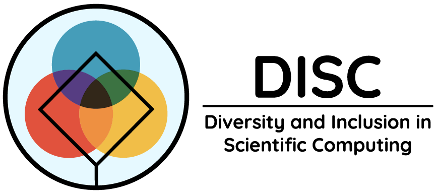

# Overcoming barriers to entry in Open Source projects

This repository contains documents and resources on getting started with Open
Source projects.

This resource was created as part of the [NumFOCUS DISC Unconference](https://pydata.org/nyc2017/diversity-inclusion/disc-unconference-2017/).  📃 Read about its creation on the [NumFOCUS blog](https://numfocus.org/blog/getting-started-open-source-notes-numfocus-disc-unconference).

### [Why contribute to Open Source?](./what_is_open_source_and_why_contribute.md)
Wondering why you contribute to Open Source?  Here are a few good reasons it can benefit both you and the world!

### [Compilation of Open Source Resources](./compilation_of_open_source_resources.md)
This file includes a collection of external resources (links) that elaborate on how to contribute to Open Source projects effectively as a newbie.

### [How to organize an Open Source sprint](./how_to_organize_an_open_source_sprint.md)
An Open Source sprint is a short event where groups of people get together to work on a single Open Source project with help from its maintainers.  We provide detailed instructions and resources for organizing an Open Source sprint at your company, club or Meetup Group. 

### [Meet the Contributors](./open_source_stories.md)
About the contributors to this repo and their Open Source experience.
